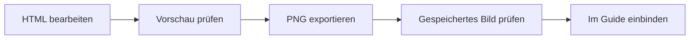

# Bearbeiten, exportieren und prüfen

## Bestehende Grafik bearbeiten

`templates/hot-zone.html` im Browser öffnen. Über **Texte bearbeiten** lassen sich Überschrift, Unterzeile, Kernaussage und Grafiknummer anpassen. Diese Änderungen gelten für die aktuelle Ansicht und den Export. Zum dauerhaften Speichern die entsprechenden Texte in der HTML-Datei mit einem Texteditor ändern.

Das Formular bearbeitet noch nicht alle Diagrammtexte. Mechaniken, Labels, Anordnung und Quellenzeile werden im SVG innerhalb der HTML-Datei geändert. Formular-Standardwerte und SVG-Texte zusammen aktualisieren.

## Eine weitere Grafik anlegen

1. Die Vorlage unter einem neuen Themennamen in `templates/` kopieren.
2. Guide-Link, Dateititel, SVG-Titel und SVG-Beschreibung aktualisieren.
3. Kernaussage und passende Diagrammform festlegen.
4. Texte, Diagramm und Quellenstand ändern. Aussagen mit Quelle oder Guider abgleichen.
5. Dateinamen im Exportcode auf das neue Thema anpassen. Aktuell sind dort die Hot-Zone-Namen hinterlegt.
6. HTML öffnen, prüfen und das PNG unter demselben Themennamen in `exports/` ablegen.
7. Bei einem neuen wiederverwendbaren Muster die Design-Dokumentation ergänzen.

Die aktuelle Vorlage ist eine einzelne HTML-Datei mit eingebetteten Schriften, CSS, SVG und Exportfunktion. Für neue Guides ist kein Framework erforderlich.

## Export

**PNG speichern** exportiert ausschließlich die Grafik, ohne Bedienleiste. Standard ist 2880 × 1920 Pixel; alternativ sind 1440 × 960 Pixel verfügbar. **SVG speichern** erzeugt eine Vektordatei mit eingebetteten Schriften und Lizenzhinweisen. Das PNG ist das vorgesehene Format für die Guides.

## Vor der Veröffentlichung prüfen

- Aussagen, Werte und Spielstand stimmen mit Quelle oder fachlicher Bestätigung überein.
- Diagramm erklärt die Kernaussage; Geometrie und Spielerpositionen erzeugen keine falsche Aussage.
- Keine Texte überlappen oder werden abgeschnitten.
- Vorschau auf Desktop und einem schmalen Bildschirm prüfen. Auf dem Handy auch die vergrößerte Ansicht nutzen.
- Textbearbeitung, Auflösungswahl und Export funktionieren.
- Im gespeicherten PNG erscheinen Umlaute, Schriften, Farben und Linien korrekt.
- Quellenzeile, SVG-Beschreibung, Guide-Link und Exportdateiname passen zum Thema.
- Guide enthält Alternativtext und eine verständliche Erklärung der Bildaussage.

## Bisherige Prüfung

Am 26. September 2026 wurden die HTML-Vorschau, Textbearbeitung und der PNG-Export im Chromium-basierten Browser geprüft. Die Bedienoberfläche wurde bei 375 Pixel Breite geprüft; die Bilddatei mit 2880 × 1920 Pixeln wurde visuell kontrolliert. Nach der XP-Ergänzung wurden die neue Bonusdarstellung und der PNG-Export erneut geprüft.

Safari und Firefox sowie eine tatsächliche Einbindung in die WDF-Website sind bisher nicht geprüft. Für eine Veröffentlichung den Export im verwendeten Browser und das Bild im Guide kontrollieren.
