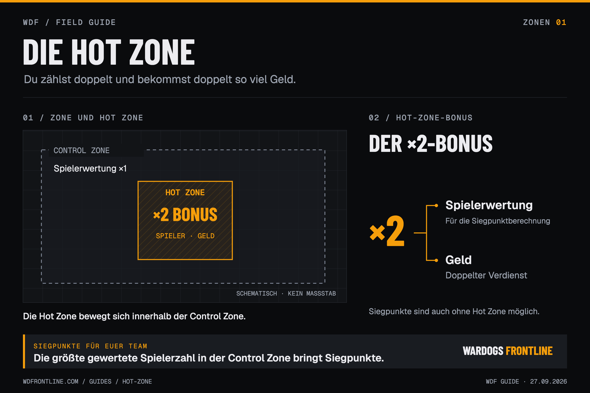

# Die Hot Zone

In der Hot Zone zählst du doppelt und bekommst doppelt so viel Geld. Ob es sich lohnt, sie zu besetzen, hängt von der Situation ab.

## Was die Hot Zone bringt

Die Hot Zone bewegt sich innerhalb der Control Zone. Wer sich darin aufhält, zählt bei der Siegpunktberechnung doppelt und bekommt doppelt so viel Geld. Für XP gibt es keinen Hot-Zone-Bonus.

Das bedeutet nicht, dass euer Team doppelte Siegpunkte erhält. Für die Mehrheitswertung zählt jeder Spieler in der Hot Zone als zwei Spieler.

## Was über Siegpunkte entscheidet

Entscheidend ist die gewertete Spielerzahl eines Teams in der gesamten Control Zone. Spieler in der Hot Zone werden dabei doppelt berücksichtigt. Das Team mit der größten gewerteten Spielerzahl bekommt Siegpunkte.

Ihr könnt deshalb auch punkten, ohne die Hot Zone zu besetzen.

## Wann ihr hineingeht

Eine feste Aufteilung nach dem Muster „ein paar hinein, der Rest sichert“ passt nicht zu jeder Situation. Die Hot Zone bewegt sich, und die Lage verändert sich laufend.

Manchmal lohnt es sich, Gegner hineinlaufen und gegeneinander kämpfen zu lassen. Wenn sie sich gegenseitig aufgerieben haben, könnt ihr ihnen in den Rücken fallen. In anderen Situationen lohnt es sich, den Bonus selbst zu nutzen.

Achtet auf die ganze Control Zone, die Gegner und eure eigenen Positionen. Die Hot Zone ist ein Vorteil, kein Pflichtziel.

---

Stand: 27. September 2026. Überarbeitet auf Grundlage des [WDF-Guides](https://wdfrontline.com/guides/hot-zone) und der fachlichen Ergänzungen des Guiders. Herkunft der Aussagen: [Projektkontext](../docs/context.md).
